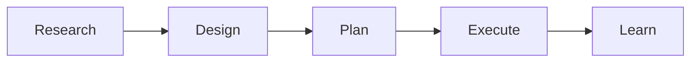
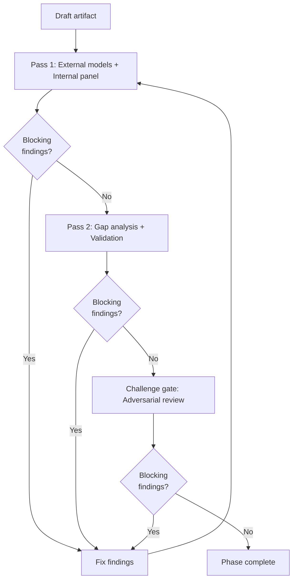

# phasebook

A phased workflow framework for [Claude Code](https://docs.anthropic.com/en/docs/claude-code). Structures AI-driven work into five phases — **Research, Design, Plan, Execute, Learn** — with multi-model review cycles, specialist panels, and task tracking.



> Each phase runs a full **review cycle** before advancing — see [The review cycle](#the-review-cycle) below.

## What it does

Phasebook turns Claude Code into a disciplined engineering workflow. Each task moves through phases, with review gates between them. You control the pace: auto-advance phases you trust, pause for review on phases that need human judgment.

**Key features:**
- **Phased workflow** — Research → Design → Plan → Execute → Learn, each with structured artifacts
- **Multi-model external reviews** — 4-7 AI models review every artifact in parallel, catching different things
- **Specialist internal panel** — 3-5 role-based reviewers (logical consistency, completeness, codebase verification, domain accuracy, risk analysis)
- **Cyclical review** — fix cycles restart the review until clean, up to 3 restarts
- **Obligation ledger** — tracks every claim, assumption, and integration point through the pipeline
- **Task decomposition** — fan-out/fan-in for tasks too large for a single context window
- **Token cost tracking** — per task, per phase, per model
- **Concurrent workers** — multiple Claude Code sessions process tasks in parallel on main
- **Human feedback** — `>>` markers in any artifact for inline feedback, questions, or overrides

## Install

```bash
git clone https://github.com/tonfield/claude-phasebook.git ~/projects/phasebook
cd ~/projects/phasebook
pip install -e .
```

## Quick start

```bash
# In your project directory
cd ~/projects/my-project
git init  # if not already a git repo

# Initialize phasebook
phasebook init

# Create your first task (in Claude Code)
/draft add user authentication

# View the task index
/index

# Start processing
/phasebook
```

## How it works

### Tasks

A task is a markdown file that moves through folders:

```
phasebook/tasks/
├── drafts/       ← create and edit tasks here
├── queue/        ← ready for processing
├── progress/     ← worker is actively processing
├── review/       ← waiting for human review
├── completed/    ← all phases done
└── archived/     ← long-term storage
```

Task filenames encode metadata: `<priority>.<strip>.<slug>.md`

- **Priority** (1-9): lower = processed first
- **Strip** (4 chars): controls per-phase review gates
- **Slug**: kebab-case identifier

Example: `1.--++.add-auth.md` — priority 1, review Research and Design, auto-advance Plan and Execute.

### The strip

The strip is 4 characters, one per phase (R D P E). Each position is either:

| Char | Meaning |
|------|---------|
| `-` | Pause for human review after this phase |
| `+` | Auto-advance to next phase |
| `R/D/P/E` | Phase completed |

Both `-` and `+` get the **same review cycle**. The difference is whether a human gates the transition afterward.

Common patterns:
```
----    Review everything (safest)
--++    Review research + design, auto plan + execute
++++    Full auto (use with caution)
+++-    Auto early phases, review execute
```

### Phases

| Phase | Purpose | Artifact |
|-------|---------|----------|
| **Research** | Investigate, gather evidence, verify assumptions | `phasebook/research/<date>-<slug>.md` |
| **Design** | Architecture, alternatives, trade-offs, decisions | `phasebook/designs/<date>-<slug>.md` |
| **Plan** | Step-by-step implementation with risk levels and verification criteria | `phasebook/plans/<date>-<slug>.md` |
| **Execute** | Implement code per plan steps, dispatched to subagents | Code changes + `phasebook/executions/` |
| **Learn** | Extract patterns, update system knowledge, docs | `phasebook/learnings/<date>-<slug>.md` |

Each phase begins with **prompt optimization** — enriching the raw task with relevant context from CLAUDE.md, prior artifacts, and the codebase. Phases scale by adjusting depth, not by skipping phases.

---

## The review cycle

The review cycle is the core quality mechanism. It runs inside every phase and keeps cycling until the artifact is clean. The sequence is always: **Pass 1 → Fix → Pass 2 → Fix → Restart check → Challenge gate → Complete.**



### Step 1: Risk classification

Every phase starts by classifying its risk level, which determines review depth:

| Level | Characteristics | What runs |
|-------|----------------|-----------|
| **LOW** | Single module, clear scope | External models + Pass 2 |
| **MEDIUM** | Multi-module, new interfaces (default) | External + internal panel + Pass 2 |
| **HIGH** | Critical paths, shared state | External + internal + Pass 2 + adversarial challenge |

### Step 2: Pass 1 — External + internal reviews

Two review tracks run **in parallel**:

#### External review panel

Multiple AI models review the artifact independently via `external_review.py`. The script calls 4-7 models in parallel and returns structured findings. Each model grades the artifact (A-F) and returns BLOCKING and ADVISORY findings with quoted evidence.

Models are selected by risk level from a configurable roster (`review_models.json`):

```
LOW:    4 models  (e.g. Gemini, GLM, Hunter, Kimi)
MEDIUM: 5 models  (+ GPT)
HIGH:   6+ models (+ adversarial challenger)
```

Three review modes depending on the phase:

| Mode | Used for | Focus |
|------|----------|-------|
| `review` | Research, Design, Plan | Logical soundness, correctness, completeness, assumptions, alternatives |
| `code` | Execute | Bugs, contract violations, edge cases, test coverage, data flow |
| `challenge` | Challenge gate | Confirmation bias, wrong abstraction, dangerous omissions, blast radius |

#### Internal specialist panel

Claude generates a tailored panel of 3-5 specialist reviewers based on the artifact's content. Each specialist runs as a subagent with specific dimensions, exclusions, and personas — ensuring focused, non-overlapping coverage.

| Role | Focus |
|------|-------|
| **Logical Consistency** | Contradictions, circular reasoning, edge cases, race conditions |
| **Completeness** | Missing paths, unhandled errors, gaps in coverage |
| **Codebase Verification** | Reads actual source code to verify every claimed function, signature, and hook point |
| **Domain Accuracy** | Spawns named domain specialists (e.g. options pricing, distributed systems) |
| **Risk & Assumptions** | Unstated assumptions, failure modes, performance costs, external service resilience |
| **Testability** | Can this be tested? What needs mocking? Test strategy for non-trivial behavior |
| **Plan Compliance** | Does the implementation match the specification? |
| **Verification Coverage** | Test quality, assertion coverage, reproducibility |
| **Integration Impact** | Cross-module dependencies, upstream/downstream effects |

#### Synthesis

All findings (external + internal) are pooled into a single synthesis:
- Each finding classified as **BLOCKING** or **ADVISORY**
- Cross-reviewer disagreements flagged (e.g. external says blocking, internal says fine)
- Accepted findings trigger a **fix cycle**

### Step 3: Fix cycle

Accepted BLOCKING findings are fixed:
- Research / Design / Plan — revise the document
- Execute — dispatch a subagent to implement fixes, run tests, verify green

The revised artifact is written to disk after every fix cycle.

### Step 4: Pass 2 — Gaps + validation

A different set of checks runs on the fixed artifact:

1. **Gap analysis** — A dedicated agent reads the full artifact AND all Pass 1 findings, looking for what every reviewer missed: unchallenged assumptions, cross-cutting concerns, internal contradictions, missing perspectives
2. **Self-review** — Correctness, completeness, domain risks
3. **Interface verification** — For designs/plans: verify every claimed function exists, signatures match, return types are correct (reads actual source code)
4. **Invariant sweep** — Walk every architectural invariant and design constraint in CLAUDE.md — not selectively, the full list
5. **Documentation consistency** — Check against architecture docs for contradictions
6. **Contract verification** — Walk the task's requirements and anti-goals, confirm each is satisfied
7. **Obligation ledger** — Verify all tracked claims, assumptions, and traces

Accepted findings trigger another fix cycle.

### Step 5: Cyclical restart check

If **any** pass had fixes during this cycle, the entire sequence restarts from Pass 1. This continues until a full cycle (Pass 1 + Pass 2) completes with zero fixes. Maximum 3 restarts — after that, the task moves to `review/` for human intervention.

### Step 6: Challenge gate

Triggers when both passes are clean OR always for HIGH risk tasks. An adversarial model reviews the artifact at a strategic level — questioning the framing, not the details:

- **Confirmation bias** — is evidence selectively presented?
- **Wrong abstraction** — is this solving the right problem?
- **Dangerous omissions** — what failure modes are conspicuously absent?
- **Coupling and blast radius** — what breaks when this ships?

Blocking findings trigger a fix cycle and restart the full sequence from Pass 1.

### Step 7: Complete

When clean, the phase:
1. Runs **micro-learn** — extracts generalizable findings into CLAUDE.md as Known Patterns or Known Gotchas, building project memory over time
2. Writes a review synthesis file
3. Commits the artifact
4. Advances to the next phase (or pauses for human review, based on the strip)

---

## Obligation ledger

The obligation ledger tracks factual claims and assumptions made during any phase, preventing the "I'll verify that later" problem.

| Type | Example | Resolution |
|------|---------|-----------|
| **CLAIM** | "scanner.py calls calculate_threshold()" | Read source, verify signature |
| **NEGATION** | "no other callers of _rebuild_cache()" | Exhaustive grep, document search scope |
| **ASSUMPTION** | "FlexQuery has access to exit_rule" | Test, verify, or flag as unverified |
| **TRACE** | "entry_cost flows: transform → db → dashboard" | Verify each hop in the chain |
| **FIX_IMPACT** | "changed parameter X that has dependents" | Check each caller/consumer |

Evidence must include the tool command and result — not just a file:line pointer. Each phase has an "unverified budget" — Execute has zero tolerance; Research allows bounded assumptions.

## Task decomposition

For tasks too large for a single context window (3+ independent sub-areas), phasebook decomposes work using a fan-out/fan-in pattern:

1. **Shared context map** — Orchestrator builds a domain map / interface skeleton / change surface
2. **Fan-out** — Independent sub-areas dispatched to parallel subagents with structured briefings
3. **Dependency contracts** — Each subagent declares assumptions about other sub-areas
4. **Synthesis** — Orchestrator combines deliverables, validates contracts, writes the artifact
5. **Integration verification** — Dedicated verifier checks fidelity, contradictions, and dropped information

Max 2 remediation loops before escalating to re-decomposition or sequenced execution.

## Feedback

Add `>>` to any file in `phasebook/` to leave feedback. The worker reads intent from context — feedback, question, approval, or override — and resolves markers in the next revision.

```markdown
>> This assumption about the API seems wrong, check the docs
>> Why not use WebSocket instead of polling?
>> Approved, move forward
```

If a completed phase's artifact has unresolved `>>` markers when the worker picks up the task, it automatically reverts that phase and re-runs it to address the feedback.

---

## CLI commands

```bash
# Project setup
phasebook init              # Initialize phasebook in current project
phasebook update            # Update managed framework files to latest version
phasebook update --check    # Dry-run: show what would change

# Task index and status
phasebook index             # Overview of all tasks across folders
phasebook status <slug>     # Detailed status of a specific task

# Task management
phasebook submit <slug>     # drafts/ → queue/
phasebook approve <slug>    # review/ → queue/
phasebook pause <slug>      # queue/ → drafts/
phasebook archive <slug>    # completed/ → archived/
phasebook reprioritize <slug> <N>   # Change priority (1-9)
phasebook strip <slug> <strip>      # Change strip (e.g. --++)

# Validation and costs
phasebook lint              # Validate filenames, structure, find orphans
phasebook costs             # Token usage breakdown by task and phase
```

## Claude Code slash commands

Use these inside Claude Code conversations:

| Command | Purpose |
|---|---|
| `/draft <task>` | Create a task with smart enrichment and review |
| `/phasebook` | Start the worker loop — processes tasks from queue |
| `/phasebook stop` | Stop the worker after the current phase completes |
| `/index` | Show the task index (calls `phasebook index`) |
| `/status <slug>` | Executive overview of a task (calls `phasebook status`) |
| `/review` | Run external + internal review panel on an artifact |
| `/optimize <topic>` | Optimize a prompt, then execute it |

## External review setup

Phasebook calls external AI models to review artifacts. The model roster and providers are configured in `.claude/scripts/review_models.json`.

### Supported providers

| Provider | SDK | Endpoint |
|----------|-----|----------|
| **Gemini** | Native (`google-genai`) with thinking support | `generativelanguage.googleapis.com` |
| **MiniMax** | OpenAI-compatible | `api.minimax.io/v1` |
| **Kilocode** | OpenAI-compatible (OpenRouter) | `api.kilo.ai` |
| **Z.AI** | OpenAI-compatible | `api.z.ai` |
| Any OpenAI-compatible | OpenAI SDK | Custom `base_url` |

Adding a new model on an existing provider requires only a JSON entry. Adding a new provider SDK type requires Python changes.

### API keys

Resolution order:
1. `~/.config/phasebook/api_keys.json` (machine-wide, all projects)
2. Environment variables (`GEMINI_API_KEY`, etc.)
3. `.claude/scripts/api_keys.json` (project-local, gitignored)

```bash
# Install review dependencies
pip install -e ".[review]"

# Check available models and API key status
python3 .claude/scripts/external_review.py --list-models

# Dry run a review
python3 .claude/scripts/external_review.py artifact.md --risk MEDIUM --dry-run
```

## Project structure after `phasebook init`

```
your-project/
├── CLAUDE.md                    ← Project context (you edit this)
├── .claude/
│   ├── rules/                   ← 10 behavioral rules (managed)
│   ├── phases/                  ← 5 phase instructions (managed)
│   ├── agents/                  ← 2 review agents (managed)
│   ├── skills/                  ← 6 slash commands (managed)
│   ├── scripts/                 ← review, notify, context, tokens (managed)
│   ├── references/
│   │   └── reference-data.md    ← Patterns, gotchas, decisions (you edit)
│   ├── settings.json            ← Hooks config (you edit)
│   └── .phasebook-version
└── phasebook/
    ├── tasks/
    │   ├── drafts/
    │   ├── queue/
    │   ├── progress/
    │   ├── review/
    │   ├── completed/
    │   └── archived/
    ├── research/                ← Phase artifacts
    ├── designs/
    ├── plans/
    ├── executions/
    ├── learnings/
    ├── reviews/                 ← Review synthesis files
    ├── obligations/             ← Obligation ledger files
    ├── tokens/                  ← Per-task cost tracking
    └── token-usage.json         ← Lifetime cost aggregate
```

**Managed files** are overwritten by `phasebook update`. **User files** (CLAUDE.md, reference-data.md, settings.json, review_models.json, api_keys.json) are never touched by updates.

## Updating

When phasebook is updated, run `phasebook update` in your project to get the latest framework files:

```bash
cd ~/projects/phasebook && git pull
cd ~/projects/my-project
phasebook update --check   # See what changed
phasebook update           # Apply updates
```

## Requirements

- Python 3.11+
- Git
- [Claude Code](https://docs.anthropic.com/en/docs/claude-code)
- Optional: `openai` and `google-genai` packages for external reviews
